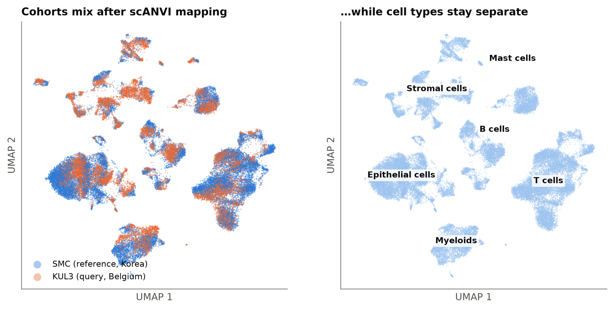
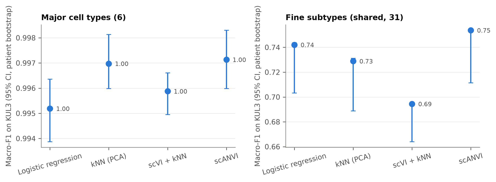
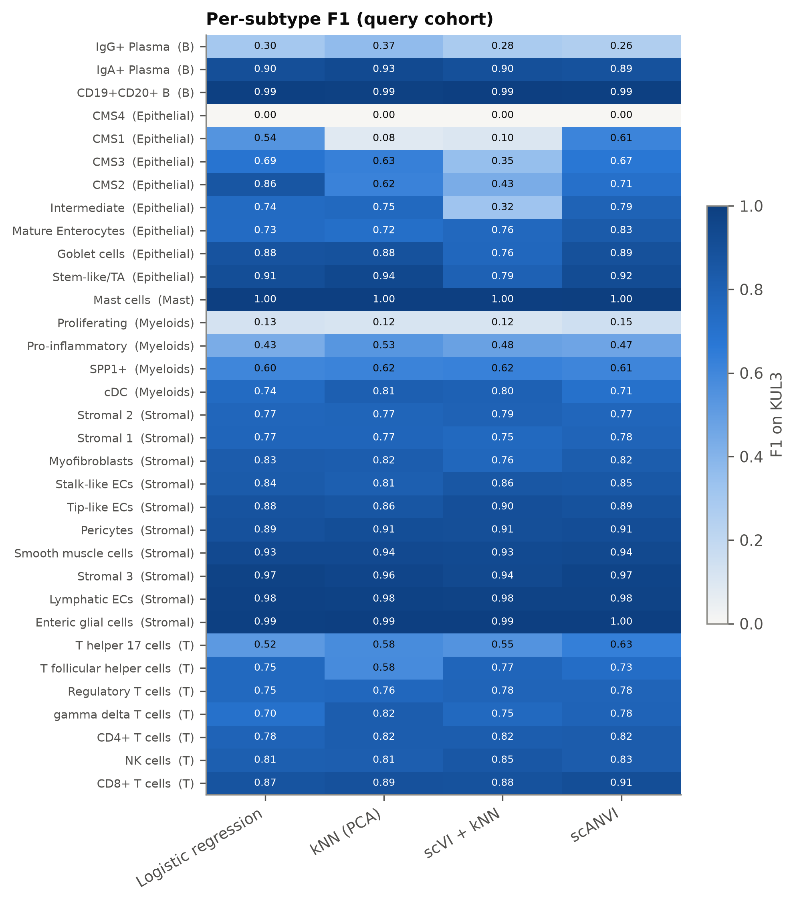
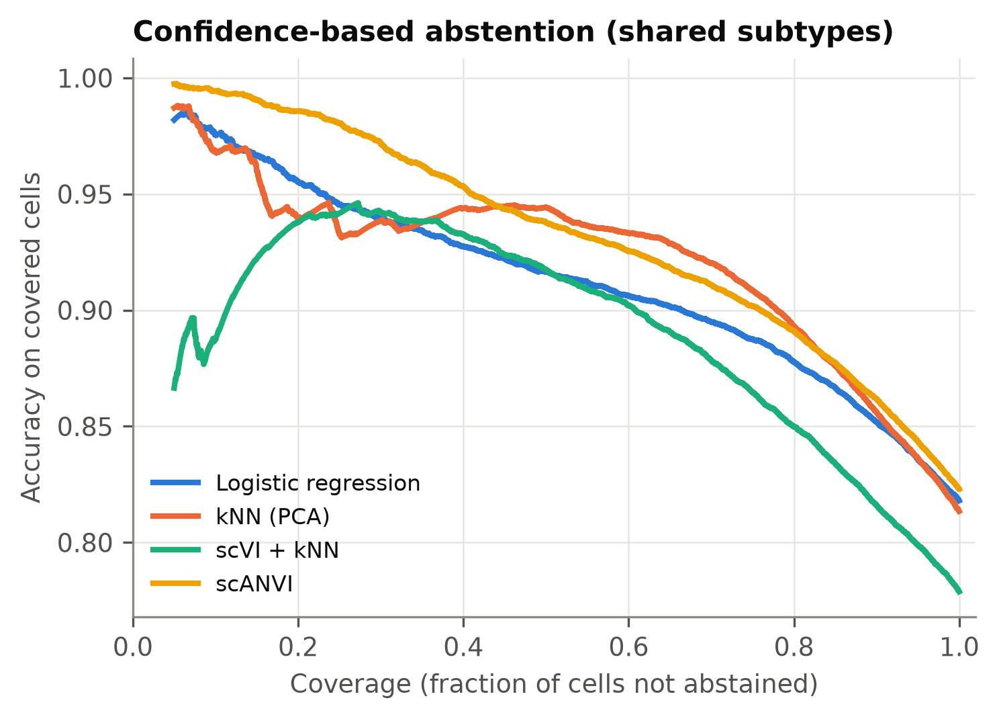
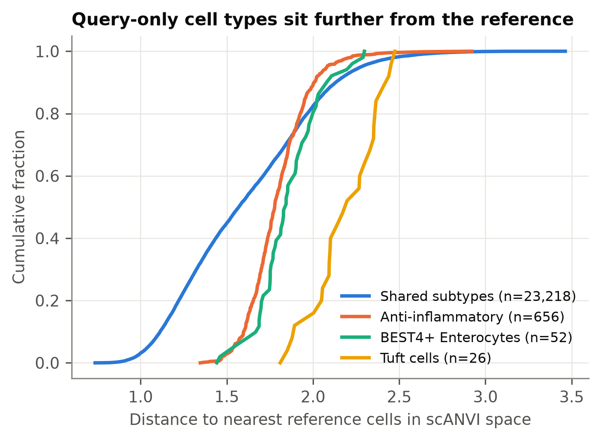
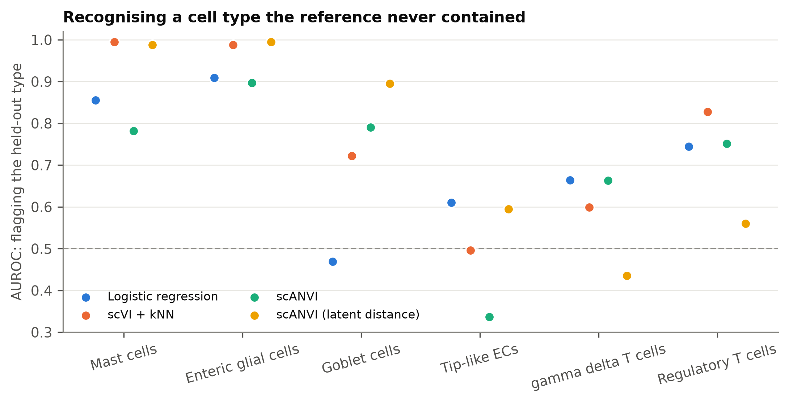

# Cross-cohort cell-type annotation in colorectal cancer, with honest uncertainty

**Can a deep generative model trained on one hospital's tumours annotate another hospital's —
and admit when it sees a cell type it was never taught?**

My bench work is on colorectal cancer (CRC), and this project comes from a practical problem in
that field: every new scRNA-seq cohort needs its cells annotated, and re-clustering plus manual
marker inspection takes weeks and drifts between labs. Reference mapping promises to transfer an
existing atlas's labels automatically. But a classifier forced to choose among the labels it knows
will confidently mislabel anything genuinely new — and in cancer, "genuinely new" is often the
interesting part. So I evaluated both halves of the problem: **how accurately labels transfer
across cohorts, and whether each method knows when it shouldn't answer.**

The setup uses the two CRC cohorts of
[Lee et al., 2020](https://doi.org/10.1038/s41588-020-0636-z), profiled in different countries at
different centres: **SMC (Korea, 23 patients, ~63k cells) as the annotated reference and KUL3
(Belgium, 6 patients, ~27k cells) as the query.** The query's own labels are used only for
scoring, never for training — so the experiment is exactly what a lab annotating a new cohort
faces, with the answer key kept in a sealed envelope.

## Key results

| | Result |
|---|---|
| **Coarse annotation is solved** | All four methods place ≥99% of query cells in the right major lineage (macro-F1 0.995–0.997 over 6 classes) |
| **Fine subtypes are the real test** | Best method (scANVI): **macro-F1 0.754** over 31 shared subtypes, 95% CI 0.71–0.75 (patient bootstrap); simple logistic regression is close behind (0.742) |
| **What fails is biology, not noise** | Discrete identities transfer perfectly (mast cells, enteric glia, CD19+CD20+ B: F1 ≈ 1.0); continuous *states* collapse (proliferating myeloid 0.15, IgG+ plasma 0.26, tumour CMS subtypes 0.0–0.71) |
| **Uncertainty is usable** | Abstaining on the 20% least-confident scANVI calls lifts accuracy on the rest from 0.82 to **0.89** — "annotate 80% automatically, review the flagged 20%" |
| **Open-set: lineages are detectable, siblings are not** | Deleting a distinct lineage from the reference is flagged near-perfectly by latent distance (mast cells, enteric glia: AUROC 0.99); deleting a subtype whose close relative remains is largely absorbed by that relative (tip-like ECs → "stalk-like" for 96% of cells; best AUROC 0.60–0.83) |
| **Annotation-vocabulary gaps are harder** | The three populations the reference annotation simply lacks are detected at best at AUROC 0.674 — plausibly because similar cells *exist* in the reference under other labels |

<p align="center"></p>

### Label transfer across cohorts



Patient-level bootstrap CIs (6 query patients, 2,000 resamples). With this few patients the
percentile interval sits at or below the point estimate — most resamples omit a patient — which
is exactly why cell-level CIs would be misleadingly narrow here.



The heatmap has a clean vertical structure: rows fail or succeed together across all four
methods. Cross-cohort transfer is limited by the *labels*, not the classifier — proliferation,
macrophage polarisation and the tumour-intrinsic CMS subtypes are continua that were discretised
differently in each cohort, and no amount of model capacity recovers a boundary that was never
sharp. (CMS4 has 11 reference cells; F1 = 0 is a sample-size statement, not a modelling one.)

### Knowing when not to answer

<p align="center">


</p>

Left: coverage–accuracy curves; scANVI's confidence is the most useful abstention signal
(0.94 accuracy at 50% coverage, 0.89 at 80%). Right: query populations absent from the
reference vocabulary sit visibly further from the reference in scANVI latent space — tuft
cells most clearly — but the overlap with the shared-type tail explains why *natural* novelty
detection (best AUROC 0.674) is far harder than the controlled deletions below.

### Open-set experiment: delete a cell type, then try to rediscover it



Six cell types were deleted from the reference one at a time; AUROC for ranking the deleted
type's query cells above the seen ones:

| Held out (n query cells) | kNN-PCA dist. | LogReg conf. | scANVI conf. | scVI dist. | scANVI dist. |
|---|---|---|---|---|---|
| Mast cells (248) | 0.479 | 0.856 | 0.782 | **0.995** | 0.988 |
| Enteric glial cells (463) | 0.952 | 0.909 | 0.897 | 0.988 | **0.995** |
| Goblet cells (165) | 0.831 | 0.469 | 0.790 | 0.722 | **0.896** |
| Tip-like ECs (930) | **0.779** | 0.611 | 0.336 | 0.496 | 0.595 |
| γδ T cells (159) | 0.383 | **0.664** | 0.663 | 0.599 | 0.435 |
| Regulatory T cells (1,111) | 0.303 | 0.745 | 0.752 | **0.828** | 0.561 |

Three lessons, each visible in the table:

1. **Missing *lineages* are easy; missing *siblings* are hard.** When the deleted type has no
   close relative in the reference (mast cells, glia), distance in the deep models' latent
   space flags it almost perfectly. When a sibling remains (tip-like vs stalk-like endothelium,
   γδ T vs NK/CD8, Tregs vs other CD4 states), the mapping absorbs the novel cells into the
   sibling's neighbourhood — scANVI called 96% of held-out tip-like ECs "stalk-like", 55% of
   γδ T cells "NK cells", 37% of Tregs "T follicular helper" — and no novelty score fully
   recovers them. These misassignments are biologically sensible, which is exactly what makes
   them dangerous in practice.
2. **Why raw-PCA distance fails on mast cells (0.479, chance) yet wins on tip-like ECs
   (0.779):** in uncorrected space *every* query cell is far from the reference, so distance
   measures the batch, drowning the strong novelty signal of a distinct lineage. But that same
   lack of correction means the embedding has not been trained to pull query cells onto their
   reference sibling — the failure and the advantage share one cause.
3. **Deleting a type barely dents the rest** (macro-F1 on the remaining seen subtypes stayed
   0.68–0.76 across all runs), so the difficulty is detection, not collateral damage.

Together with the natural-gap result (best AUROC 0.674), the practical conclusion for atlas
users: reference mapping plus a latent-distance flag will catch a genuinely new lineage, but
**an unannotated subtype of a known lineage will be silently absorbed** — which argues for
per-lineage novelty thresholds and for treating high-confidence calls within heterogeneous
compartments (T cells, myeloid, tumour epithelium) with more suspicion than the global
confidence suggests.

### Integration quality (scib-metrics)

On a 30,000-cell stratified subsample (batch = cohort, labels = major cell type), aggregate
scores out of 1:

| Embedding | Batch correction | Bio conservation | Total |
|---|---|---|---|
| PCA (uncorrected) | 0.412 | 0.659 | 0.561 |
| scVI | 0.409 | 0.803 | 0.645 |
| scANVI | **0.573** | **0.810** | **0.715** |

scANVI leads on both axes — with the caveat, stated once more, that its training saw reference
labels, so label-based conservation metrics favour it by construction. The full metric table is
in [`results/tables/integration_scib.csv`](results/tables/integration_scib.csv).


## Methods compared

| Method | Idea | Batch handling |
|---|---|---|
| Logistic regression | L2 multinomial on scaled log-normalised HVGs (the [CellTypist](https://doi.org/10.1126/science.abl5197) recipe) | none |
| kNN on PCA | project query into reference PCA, vote among neighbours | none |
| scVI + kNN | kNN vote in the latent space of an [scVI](https://doi.org/10.1038/s41592-018-0229-2) variational autoencoder | learned |
| scANVI | semi-supervised VAE with a built-in classifier head ([Xu et al., 2021](https://doi.org/10.15252/msb.20209620)) | learned |

The query is mapped into the scVI/scANVI models by **architecture surgery**
([scArches](https://doi.org/10.1038/s41587-021-01001-7)): the reference network is frozen and only
query-batch parameters are trained, so the reference embedding — and everything learned from it —
stays fixed. Each classifier also emits a per-cell **novelty score** (classifier uncertainty, or
distance to the nearest reference cells in the shared latent space), which is what the open-set
experiments evaluate.

## Design decisions that matter

- **The query never leaks into training.** Highly variable genes are selected on the reference
  only; query labels are never shown to any model; scArches keeps reference weights frozen.
- **Label vocabularies are harmonised in code, not by hand-waving.** The two cohorts were
  annotated by the same group but their fine labels drifted (`SPP1+A/B` vs `SPP1+`, split
  enterocyte subtypes). `src/scmap/labels.py` assigns every query subtype an explicit role —
  *shared* (scored), *novel* (a real population absent from the reference; scored only as a
  novelty target), or *excluded* (uninformative labels like "Unknown") — and
  `results/tables/label_roles.csv` documents every decision. An unmapped label raises an error
  rather than silently polluting the scores.
- **Patient-level bootstrap.** Cells from one patient are not independent samples; all 95% CIs
  come from resampling *patients*, not cells. Cell-level CIs would be misleadingly narrow.
- **Two kinds of open-set test.** *Natural:* three populations the reference annotation simply
  lacks (`Anti-inflammatory` macrophages, `BEST4+ Enterocytes`, `Tuft cells`). *Controlled:* six
  cell types deleted from the reference one at a time — spanning easy cases (a distinct lineage
  like mast cells) and hard ones (regulatory T cells, with close relatives still present) — then
  asking whether each method flags the deleted type in the query or confidently mislabels it.
- **Integration quality is measured, not eyeballed.** [scib-metrics](https://doi.org/10.1038/s41592-021-01336-8)
  batch-correction and bio-conservation scores on all three embeddings, with the caveat stated
  where it belongs: scANVI saw reference labels, so label-based conservation metrics favour it
  by construction.

## Reproduce

Requires [uv](https://docs.astral.sh/uv/) and ~2 GB of disk. Data download is two public GEO
series ([GSE132465](https://www.ncbi.nlm.nih.gov/geo/query/acc.cgi?acc=GSE132465),
[GSE144735](https://www.ncbi.nlm.nih.gov/geo/query/acc.cgi?acc=GSE144735)).

```bash
uv sync
make data          # download both cohorts from GEO (~190 MB)
make all           # prepare → transfer → open-set → integration → figures
make test          # unit tests
```

Every setting lives in `configs/default.yaml`. On an Apple M-series laptop the main experiment
runs in under an hour; the six open-set retrainings take a few hours (they use a shorter,
documented schedule).

## Repository layout

```
configs/default.yaml         all experiment settings
src/scmap/
  labels.py                  cross-cohort label harmonisation with explicit roles
  data.py                    streaming GEO matrix reader
  preprocess.py              reference-only HVG selection, normalisation
  baselines.py               logistic regression, kNN transfer, novelty scores
  models.py                  scVI/scANVI training, scArches query surgery
  pipeline.py                one reference→query run shared by all experiments
  evaluate.py                patient bootstrap, per-class F1, novelty AUROC
scripts/01…05_*.py           pipeline steps (wired into the Makefile)
tests/                       pytest suite, run in CI
results/tables, figures      every number and figure in this README
```

## Limitations

- **One tissue, one platform, six query patients.** Both cohorts are 10x CRC data annotated by
  the same group; a reference from a different lab, chemistry or tissue would shift harder.
  Six patients also make the bootstrap intervals coarse.
- **"Novel" means absent from the reference *annotation*, not from the reference *tissue*.**
  Anti-inflammatory macrophages likely exist in SMC tumours unlabelled — which is precisely why
  vocabulary gaps are harder to detect than physically deleted cell types.
- **Fine labels are partly conventions.** CMS subtypes and polarisation states discretise
  continua; some "errors" are disagreements about where to cut, not mistakes. The coarse/fine
  gap (0.997 vs 0.754) is partly a property of the label scheme itself.
- **Open-set runs use a shortened training schedule** (documented in `configs/default.yaml`) to
  keep six full retrainings tractable on a laptop; absolute AUROCs may shift slightly with the
  full schedule.
- **scib-metrics caveat repeated:** scANVI trained on reference labels, so label-based
  bio-conservation metrics structurally favour it.

## What I would do next

1. **A third cohort from a different platform** (e.g. inDrop or BD Rhapsody CRC data) to
   separate cohort effects from platform effects.
2. **Calibrated abstention thresholds** chosen on reference cross-validation, so the
   coverage–accuracy trade-off can be promised in advance rather than read off after the fact.
3. **A foundation-model embedding** (scGPT/Geneformer class) as a fifth transfer method, to
   test whether pretraining at atlas scale closes the fine-subtype gap.


## Data and references

- Data: Lee et al., *Lineage-dependent gene expression programs influence the immune landscape
  of colorectal cancer*, [Nat Genet 2020](https://doi.org/10.1038/s41588-020-0636-z) (GEO
  GSE132465, GSE144735).
- scVI ([Lopez et al., 2018](https://doi.org/10.1038/s41592-018-0229-2)); scANVI
  ([Xu et al., 2021](https://doi.org/10.15252/msb.20209620)); scArches
  ([Lotfollahi et al., 2022](https://doi.org/10.1038/s41587-021-01001-7)); implemented in
  [scvi-tools](https://doi.org/10.1038/s41587-021-01206-w).
- Integration metrics: [scib-metrics](https://doi.org/10.1038/s41592-021-01336-8).

## License

MIT © 2026 Matin Gerami
