# Cross-cohort cell-type annotation in colorectal cancer scRNA-seq

This project tests how well cell-type labels transfer from one colorectal cancer (CRC) single-cell cohort to another, and whether each method can flag cells whose type is missing from the reference. It uses the two cohorts of [Lee et al., 2020](https://doi.org/10.1038/s41588-020-0636-z): **SMC (Korea, 23 patients, ~63k cells) as the annotated reference and KUL3 (Belgium, 6 patients, ~27k cells) as the query.** Query labels are used only for scoring, never for training.

Built in September 2026, at the start of my M1.

## Key results

| | Result |
|---|---|
| Coarse annotation | All four methods assign ≥99% of query cells to the correct major lineage (macro-F1 0.995 to 0.997, 6 classes) |
| Fine subtypes | Best method (scANVI): **macro-F1 0.754** over 33 shared subtypes, 95% CI 0.71 to 0.75 (patient bootstrap); logistic regression: 0.742 |
| Where transfer fails | Discrete cell types transfer well (mast cells, enteric glia, CD19+CD20+ B cells: F1 ≈ 1.0); continuous states do not (proliferating myeloid 0.15, IgG+ plasma 0.26, tumour CMS subtypes 0.0 to 0.71) |
| Abstention | Rejecting the 20% least-confident scANVI calls raises accuracy on the rest from 0.82 to **0.89** |
| Open-set detection | A deleted lineage with no close relative is flagged by latent distance (mast cells, enteric glia: AUROC 0.99); a deleted subtype with a close relative is mostly absorbed by it (96% of tip-like ECs called "stalk-like"; best AUROC 0.66 to 0.83) |
| Annotation gaps | The three populations missing from the reference annotation are detected at best at AUROC 0.674, likely because similar cells exist in the reference under other labels |
| Per patient | scANVI fine-subtype accuracy ranges from 0.76 to 0.87 across the six query patients; 0.76 in tumour tissue against 0.90 in normal tissue |
| Coverage under cohort shift | Conformal sets calibrated on held-out reference patients cover **86.4%** of query cells at a 90% target; density-ratio weighting does not recover it (86.7%) |
| Hospital shift (Pelka, two hospitals) | A reference drawn from both hospitals instead of one raises scANVI macro-F1 from 0.82 to **0.92** on the smaller hospital and restores 90% coverage (0.87–0.90 → **0.94**) |
| Calibration | scANVI is over-confident (ECE 0.125 on the query); one temperature fitted on reference patients halves it (**0.063**) and transfers across cohorts |

<p align="center">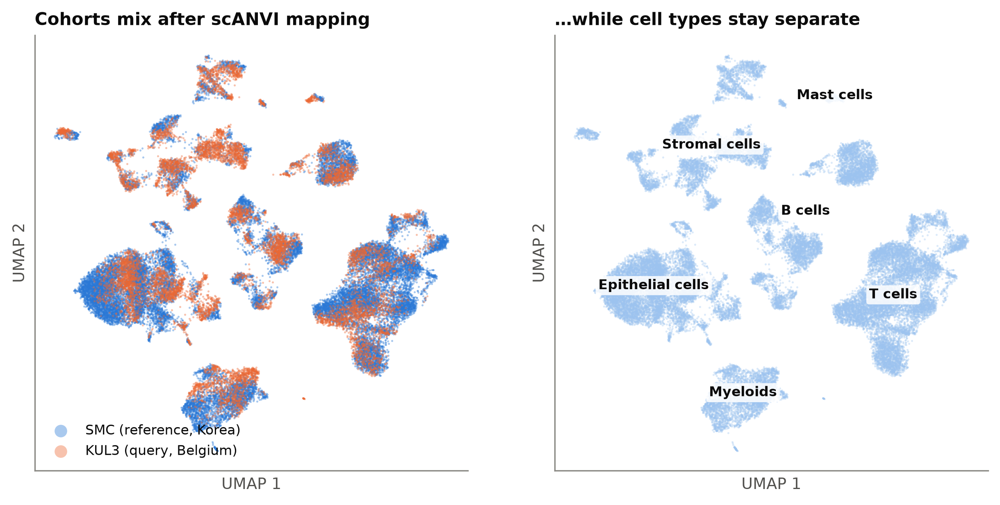</p>

### Label transfer

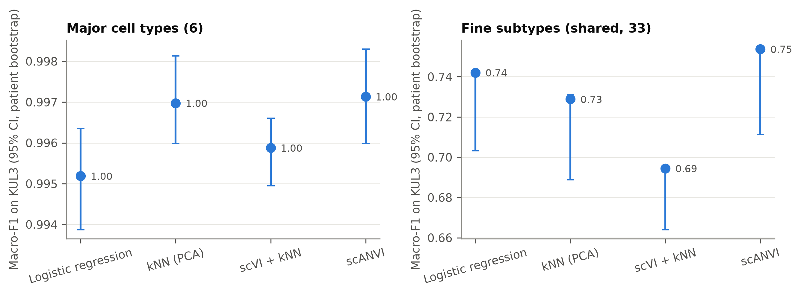

Confidence intervals come from resampling the 6 query patients (2,000 resamples), because cells from one patient are not independent. With so few patients, the percentile interval sits at or below the point estimate.

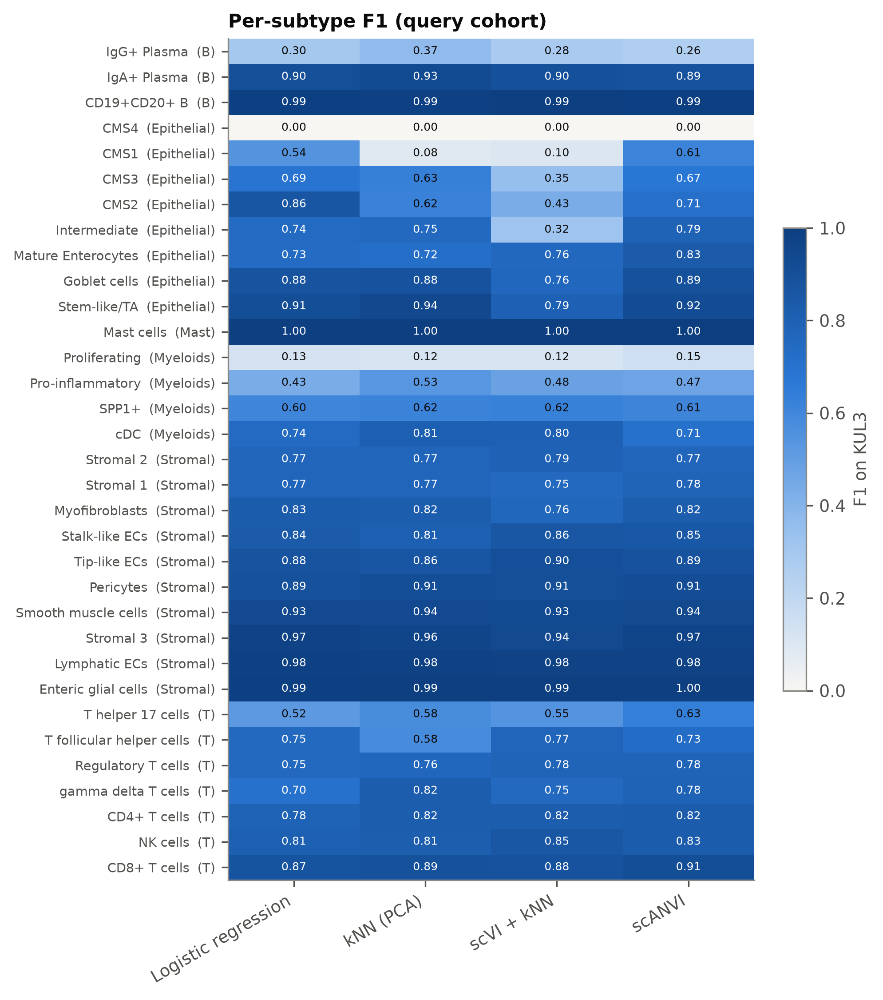

Subtypes succeed or fail together across all four methods, so the limit is mostly in the labels rather than the classifier. Proliferation, macrophage polarisation and CMS subtypes are continuous and were split differently in each cohort. CMS4 has only 11 reference cells.

### Abstention and novelty

<p align="center">
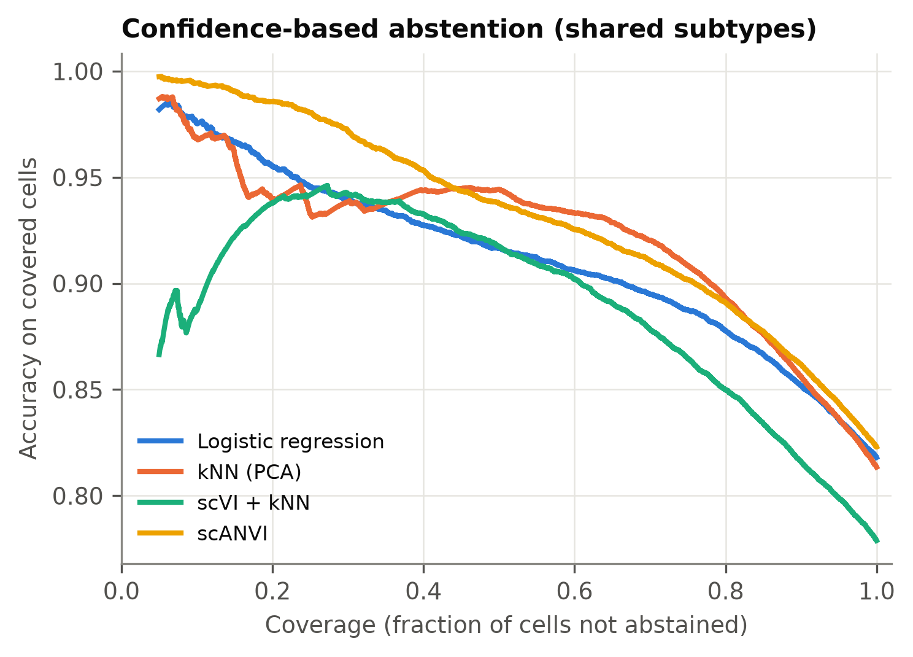
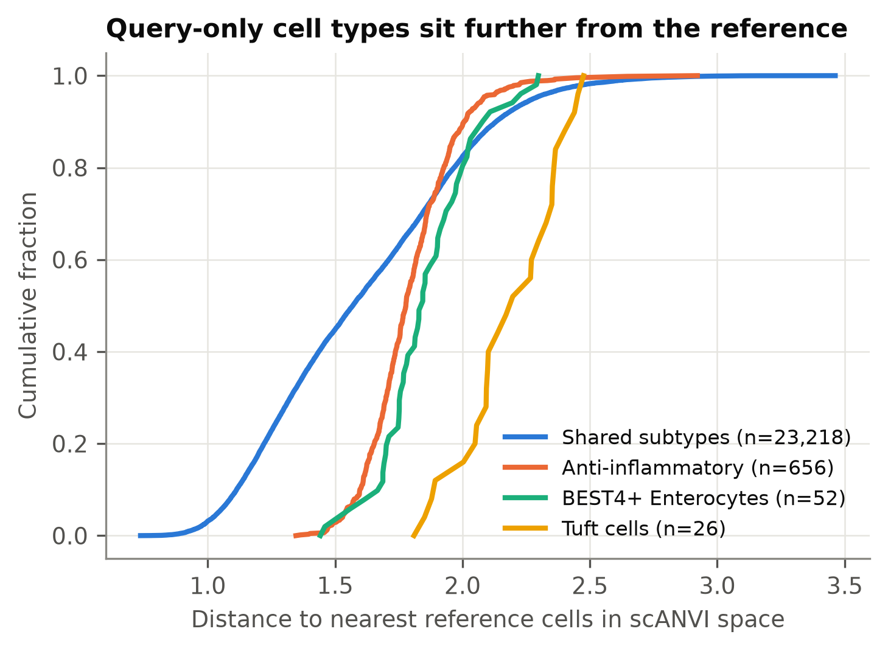
</p>

Left: coverage vs accuracy. scANVI confidence and the PCA + kNN baseline give the best abstention signal (0.94 accuracy at 50% coverage, 0.89 at 80%; the two differ by less than 0.01). Right: populations missing from the reference annotation lie further from the reference in scANVI latent space (tuft cells most clearly), but they overlap with the tail of shared types.

**Thresholds fixed in advance.** To choose an abstention threshold before seeing the query, five reference patients were held out as a calibration set, scVI and scANVI were retrained without them, and the threshold for each accuracy target was fixed on those patients, then applied to KUL3 (`scripts/06_calibrated_abstention.py`):

| Target | Threshold | Calibration (SMC held-out) | KUL3 |
|---|---|---|---|
| 90% | 0.776 | 0.900 at 92.6% coverage | 0.864 at 92.7% coverage |
| 95% | 0.986 | 0.950 at 76.1% coverage | 0.906 at 77.8% coverage |
| 98% | 0.999 | 0.980 at 54.0% coverage | 0.933 at 58.6% coverage |

Coverage transfers almost exactly, but accuracy is about 4 points below target: the cohort shift moves the confidence distribution. A fixed threshold still helps (90.6% vs 83.5% unfiltered for the same model at the 95% target), but reliable guarantees would need shift-aware calibration.

### Open-set experiment

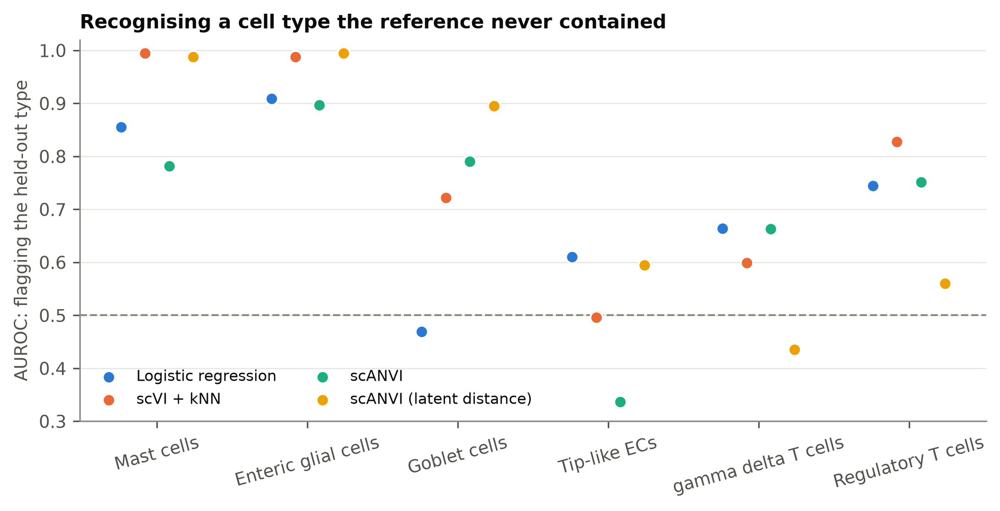

Six cell types were deleted from the reference one at a time. AUROC for ranking the deleted type's query cells above the seen ones:

| Held out (n query cells) | kNN-PCA dist. | LogReg conf. | scANVI conf. | scVI dist. | scANVI dist. |
|---|---|---|---|---|---|
| Mast cells (248) | 0.479 | 0.856 | 0.782 | **0.995** | 0.988 |
| Enteric glial cells (463) | 0.952 | 0.909 | 0.897 | 0.988 | **0.995** |
| Goblet cells (165) | 0.831 | 0.469 | 0.790 | 0.722 | **0.896** |
| Tip-like ECs (930) | **0.779** | 0.611 | 0.336 | 0.496 | 0.595 |
| γδ T cells (159) | 0.383 | **0.664** | 0.663 | 0.599 | 0.435 |
| Regulatory T cells (1,111) | 0.303 | 0.745 | 0.752 | **0.828** | 0.561 |

- **Missing lineages are easy to detect, missing subtypes are not.** When the deleted type has a close relative in the reference, the mapping assigns it to that relative: scANVI called 96% of held-out tip-like ECs "stalk-like", 55% of γδ T cells "NK cells" and 37% of Tregs "T follicular helper".
- **Raw PCA distance fails on mast cells (0.479) but does best on tip-like ECs (0.779).** Without batch correction every query cell is far from the reference, which hides the signal of a distinct lineage; but the uncorrected space also does not pull query cells onto their closest reference subtype.
- **Deleting a type barely affects the others:** macro-F1 on the remaining subtypes stayed between 0.68 and 0.76.

### Second external cohort (Pelka et al., 2021)

To test false alarms under a shift with no novel populations, a 40,000-cell random subsample of the [Pelka et al., 2021](https://doi.org/10.1016/j.cell.2021.08.003) atlas (GSE178341: 62 patients, two hospitals, 10x v2 and v3) was mapped onto the same reference. All seven of its top-level populations exist in the reference.

- Coarse labels transfer well: macro-F1 **0.991** (95% CI 0.989 to 0.993, bootstrap over 62 patients).
- With the novelty threshold at the 95th percentile of KUL3 shared-subtype distances, 8.3% of Pelka cells are flagged, slightly above the 5% expected.
- The same threshold flags only 2.7% of KUL3's novel cells. Their distances are in the middle of the distribution, not the tail, so a single global threshold cannot separate them.

<p align="center">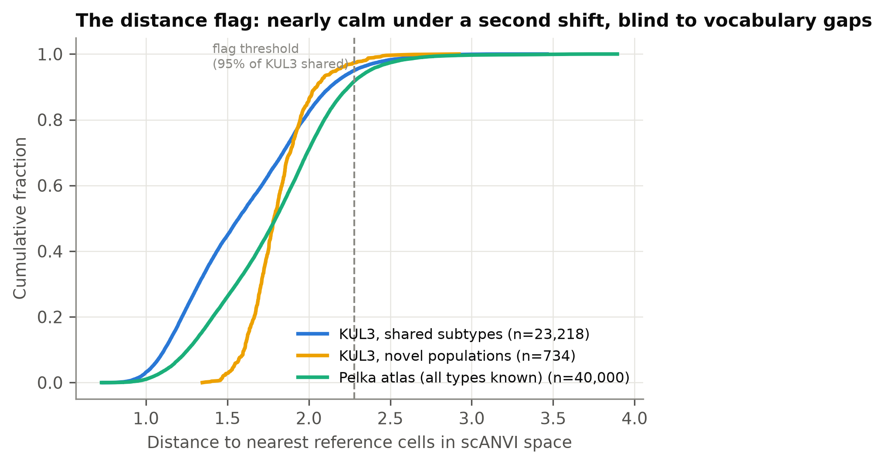</p>

### Variation across patients and tissues

Pooled metrics hide how much performance depends on the patient. On the shared fine
subtypes, scANVI's accuracy ranges from 0.76 (KUL21) to 0.87 (KUL30) across the six query
patients, and every method does worse on tumour cells (scANVI 0.76) than on normal mucosa
(0.90), with the tumour border in between (`scripts/08_per_patient.py`).

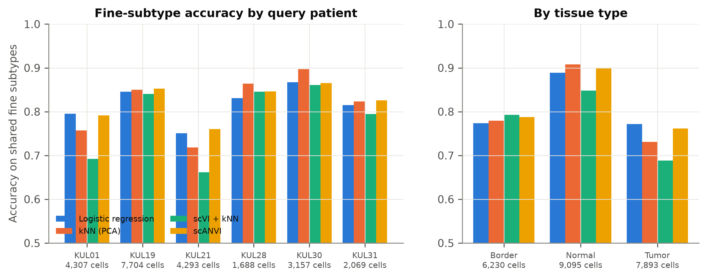

### Conformal sets under cohort shift

Split conformal prediction (score 1 - p(true subtype)) calibrated on the five held-out
reference patients covers 0.864 and 0.914 of the Belgian query at the 90% and 95% levels,
with per-patient coverage between 0.82 and 0.91 at the 90% level. (On the calibration cells
themselves coverage is 0.900 and 0.950 by construction, so that is not a held-out check.)
Per-subtype thresholds do not recover the loss, but several subtypes have fewer than nine
calibration cells, which makes their 90% threshold infinite; whether the loss is spread over
all types or concentrated in a few is not settled by this design
(`scripts/09_conformal_shift.py`; full tables in [`MODEL_CARD.md`](MODEL_CARD.md)).

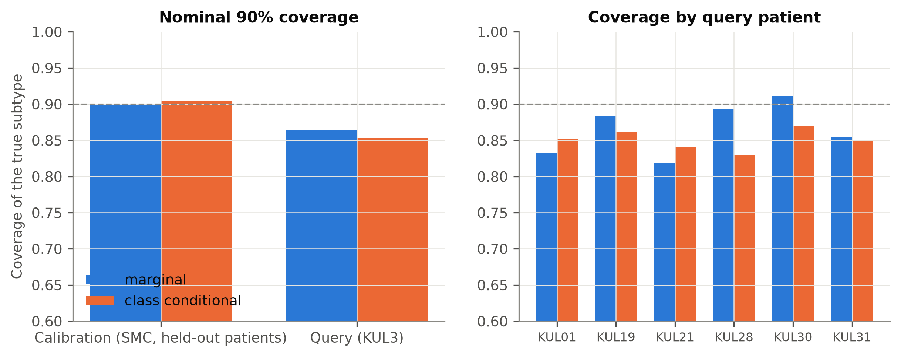

### Per-lineage novelty thresholds do not help

An earlier version of this README suggested setting the novelty threshold per lineage. Tested
(`scripts/10_per_lineage_novelty.py`), it makes things worse: standardising each cell's latent
distance within its predicted major lineage lowers the AUROC for the three populations missing
from the reference annotation from 0.674 to 0.373, and at a 5% false-alarm rate the
per-lineage thresholds catch 2.5% of novel cells against 2.7% for the global one. The left
panel shows why: the novel cells (orange) sit inside the distance distribution of the
epithelial and myeloid lineages they are assigned to. The modest global AUROC therefore came
from those lineages being further from the reference in general, not from the novel cells
being unusual within them. Detecting an unannotated subtype needs a different signal than
distance to the nearest reference cells.

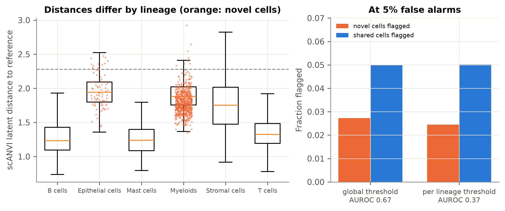

### How many reference patients are needed

Label transfer with the logistic-regression baseline, repeated on random subsets of the
reference patients with genes reselected each time (`scripts/11_reference_size.py`): three
patients give unstable results (fine macro-F1 0.42 to 0.72 across draws), six give 0.72,
and from ten patients on the curve is flat (0.73 to 0.74; the full 23 patients give 0.74).
Coarse accuracy is above 0.98 even with three patients. The ceiling on fine subtypes is set
by the label conventions, not by the size of the reference. Repeating the curve with scANVI
itself (`scripts/14_reference_size_scanvi.py`, one draw per size, scArches mapping) gives the
same picture: 0.39 with three patients, 0.73 with six, 0.74 with all 23, with patient-bootstrap
intervals of about 0.05.

<p align="center">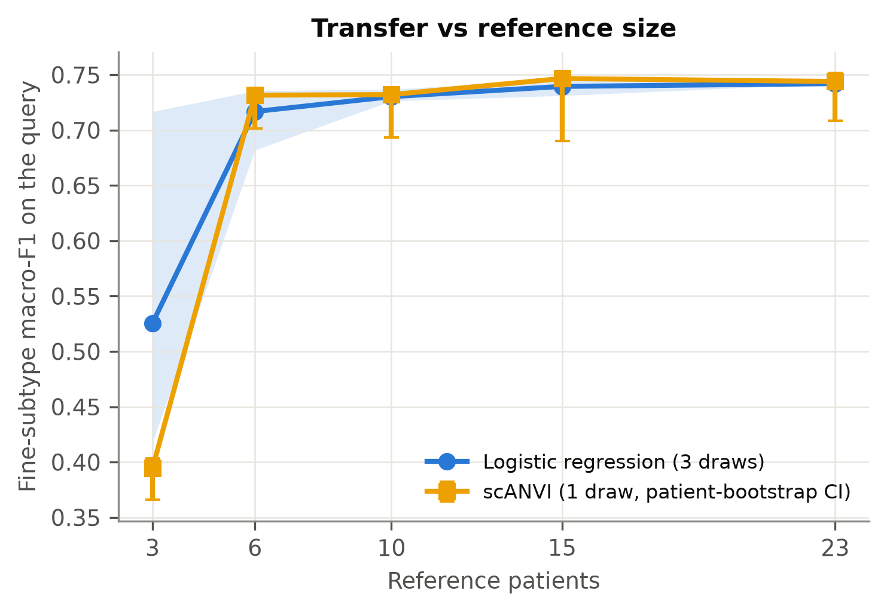</p>

### Shift-aware calibration does not recover the loss

Weighted conformal prediction (Tibshirani et al., 2019) is the standard remedy when the
shift is in the inputs: calibration cells are weighted by the estimated density ratio
between query and calibration in the scANVI latent space, from a cross-fitted logistic
classifier (`scripts/12_weighted_conformal.py`). Here it changes coverage on the query from
0.864 to 0.867 at the 90% level and from 0.914 to 0.922 at 95%, while shrinking the
effective calibration size from 11,051 to 2,393 cells. Reweighting the inputs, as estimated
here, does not recover the loss. One explanation is the labels: the same cell states may have
been discretised differently in the two cohorts, which no reweighting of inputs can correct.
That remains a hypothesis. The density ratio is estimated in a latent space trained to mix
batches, which hides input shift by design, and the classifier's folds follow the patient order
of the data, so it is scored on patients it has not seen; cells from the same patients in both
folds would separate the cohorts more easily.

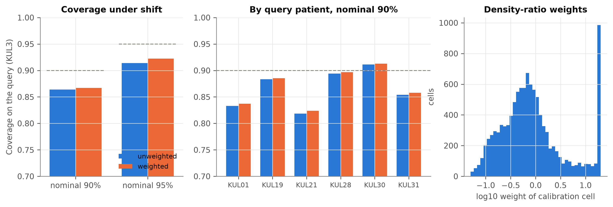

### Is the confidence calibrated, and does calibration survive the shift?

scANVI's confidence is over-confident even on held-out patients of its own cohort: mean
confidence 0.96 against accuracy 0.87 on the five calibration patients (expected calibration
error 0.090), and 0.96 against 0.835 on KUL3 (ECE 0.125). One temperature fitted on the
calibration patients (T = 1.94, `scripts/16_calibration_shift.py`, `scmap.calibration`)
brings the reference ECE to 0.024 and, applied unchanged, halves the query ECE to 0.063; per
KUL3 patient it drops from 0.08 to 0.17 raw to 0.04 to 0.09 scaled. So the shape of the
over-confidence transfers across cohorts and a cheap post-hoc fix carries over, even though
the abstention thresholds above did not: calibrating the probabilities is a different
problem from guaranteeing coverage.

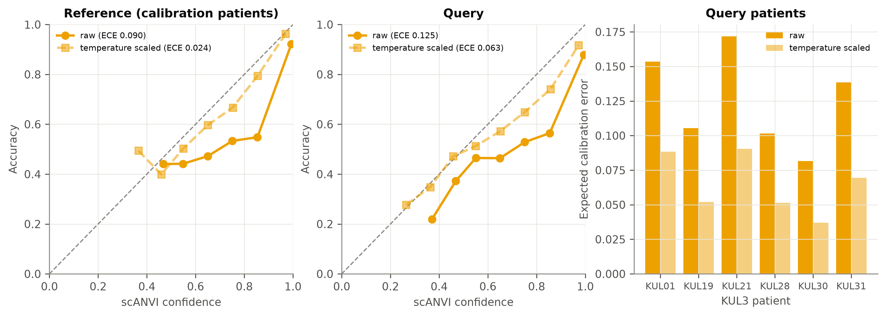

### Do residual doublets fool the annotation, and does the novelty score catch them?

Two cells in one droplet give a hybrid profile that no single label fits. The query annotations were filtered by their authors, so this asks about the doublets that survived. `scripts/17_doublets.py` scores every sample with Scrublet ([Wolock et al., 2019](https://doi.org/10.1016/j.cels.2018.11.005), scanpy implementation, automatic threshold; the 75-cell KUL31-T sample is too small to score) and relates the call to each method's coarse error and novelty score.

| Method | Coarse error, predicted doublets vs singlets | AUROC of the novelty score for doublets (95% CI over patients) | Share of doublets in the 10% most novel cells |
|---|---|---|---|
| scANVI, latent distance | 16% vs 0.2% | **0.86** (0.83 to 0.93) | **63%** |
| scVI + kNN | 24% vs 0.3% | 0.80 (0.76 to 0.86) | 55% |
| PCA + kNN | 15% vs 0.2% | 0.78 (0.70 to 0.87) | 50% |
| scANVI, 1 − confidence | 16% vs 0.2% | 0.72 (0.66 to 0.78) | 20% |
| Logistic regression, 1 − confidence | 20% vs 0.4% | 0.65 (0.54 to 0.78) | 22% |

Only 60 of 27,339 scored cells (0.2%) are called doublets, so the authors' filtering removed most of them, but the ones left are mislabelled 56 to 88 times more often than singlets. Distance in the latent space flags them far better than the classifier's own confidence: abstaining on the 10% most distant cells removes 63% of the residual doublets, against 20% for the softmax score. A doublet sits between two cell-type clusters, which is far from every reference cell, while a classifier forced to choose between two plausible labels can still be confident about one of them. This supports using a distance-based novelty score for abstention. With 60 doublets the intervals are wide, and "error" means disagreeing with the authors' single label for a two-cell profile.

### Does a multi-hospital reference help? A controlled test on Pelka et al.

The Pelka atlas was collected at two hospitals (MGH, 43 patients; DFCI, 19) with one
consistent label set, which allows a site-shift experiment the Lee cohorts cannot. With the
logistic-regression baseline and 12 reference patients, a reference drawn from the other
hospital only gives macro-F1 0.81 on DFCI, while a reference of the same size drawn from both
hospitals gives 0.89; tested on MGH the two designs are close (0.91 vs 0.89): a DFCI-only
reference transfers to MGH better than the reverse, so the shift is asymmetric. Conformal
coverage calibrated on held-out patients of the reference hospitals stays near 90% on DFCI
and around 87% on MGH in both designs (`scripts/13_site_shift_pelka.py`). Including even a
few patients from the target site closes most of the site gap; it does not remove the
coverage loss. With scANVI and scArches mapping in place of the baseline (one draw per
setting, `scripts/15_site_shift_pelka_scanvi.py`) the mixed reference helps on both
hospitals, macro-F1 0.82 to 0.92 on DFCI and 0.88 to 0.93 on MGH, and coverage at the 90%
target rises from 0.90 and 0.87 to 0.94 on both, so for the deep model a mixed reference
also repairs the calibration.

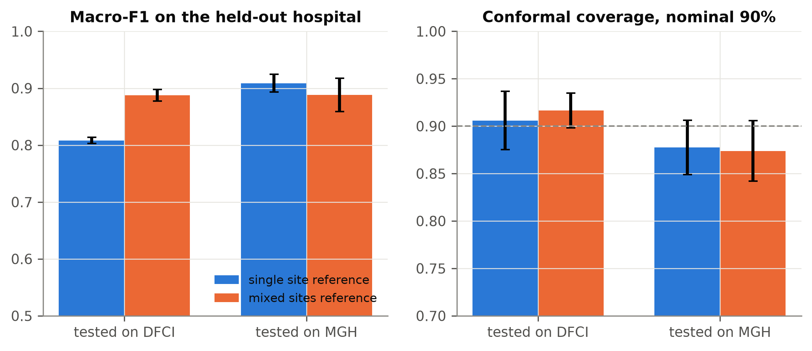

### Integration quality (scib-metrics)

30,000-cell stratified subsample, batch = cohort, labels = major cell type:

| Embedding | Batch correction | Bio conservation | Total |
|---|---|---|---|
| PCA (uncorrected) | 0.412 | 0.659 | 0.561 |
| scVI | 0.409 | 0.803 | 0.645 |
| scANVI | **0.573** | **0.810** | **0.715** |

scANVI was trained with reference labels, so label-based conservation metrics favour it. Full table: [`results/tables/integration_scib.csv`](results/tables/integration_scib.csv).

## Methods

| Method | Idea | Batch handling |
|---|---|---|
| Logistic regression | L2 multinomial on scaled log-normalised HVGs ([CellTypist](https://doi.org/10.1126/science.abl5197) recipe) | none |
| kNN on PCA | project the query into reference PCA, vote among neighbours | none |
| scVI + kNN | kNN vote in the latent space of [scVI](https://doi.org/10.1038/s41592-018-0229-2) | learned |
| scANVI | semi-supervised VAE with a classifier head ([Xu et al., 2021](https://doi.org/10.15252/msb.20209620)) | learned |

The query is mapped into scVI/scANVI with [scArches](https://doi.org/10.1038/s41587-021-01001-7): reference weights are frozen and only query-batch parameters are trained. Each method also gives a per-cell novelty score (classifier uncertainty or latent distance to the nearest reference cells).

Design choices:

- **No query leakage.** HVGs are selected on the reference only, query labels are never used in training, and reference weights stay frozen.
- **Label harmonisation in code.** Fine labels differ between the two cohorts. `src/scmap/labels.py` marks every query subtype as shared (scored), novel (scored only for novelty) or excluded (e.g. "Unknown"); all decisions are listed in `results/tables/label_roles.csv`, and an unmapped label raises an error.
- **Patient-level bootstrap** for all confidence intervals.
- **Two open-set tests:** three populations missing from the reference annotation, and six cell types deleted one at a time.

## Reproduce

Requires [uv](https://docs.astral.sh/uv/) and ~2 GB of disk. Data: GEO [GSE132465](https://www.ncbi.nlm.nih.gov/geo/query/acc.cgi?acc=GSE132465) and [GSE144735](https://www.ncbi.nlm.nih.gov/geo/query/acc.cgi?acc=GSE144735).

```bash
uv sync
make data          # download both cohorts from GEO (~190 MB)
make all           # prepare, transfer, open-set, integration, figures, calibration, pelka, patients, conformal, lineage, refsize, weighted, siteshift, refsize-scanvi, siteshift-scanvi, calibration-shift, doublets
make test          # unit tests
scmap annotate my_query.h5ad --target 0.95 -o labels.csv   # label a new dataset with the saved reference
```

Settings are in `configs/default.yaml`. On an Apple M-series laptop the main experiment runs in under an hour; the six open-set retrainings take a few hours with a shorter, documented training schedule.

### Docker

```bash
make docker      # builds the image and runs the tests inside it; data/ and results/ are mounted
```

## Repository layout

```
configs/default.yaml         experiment settings
src/scmap/
  labels.py                  cross-cohort label harmonisation
  data.py                    streaming GEO matrix reader
  preprocess.py              reference-only HVG selection, normalisation
  baselines.py               logistic regression, kNN transfer, novelty scores
  models.py                  scVI/scANVI training, scArches query mapping
  pipeline.py                reference-to-query run shared by all experiments
  evaluate.py                patient bootstrap, per-class F1, novelty AUROC
  conformal.py               split conformal prediction sets
  calibration.py             temperature scaling, reliability curves
  cli.py                     `scmap annotate`
scripts/01…17_*.py           pipeline steps (Makefile)
tests/                       pytest suite, run in CI
results/tables, figures      all numbers and figures in this README
```

## Limitations

- One tissue, one platform, six query patients; both main cohorts were annotated by the same group, and six patients give coarse intervals.
- "Novel" means absent from the reference annotation, not from the tissue: anti-inflammatory macrophages probably exist unlabelled in SMC.
- Fine labels such as CMS subtypes and polarisation states split continuous biology, so some errors are disagreements about boundaries.
- Open-set runs use a shorter training schedule; absolute AUROCs may shift slightly with the full schedule.

## References

- Lee et al., [Nat Genet 2020](https://doi.org/10.1038/s41588-020-0636-z) (GSE132465, GSE144735); Pelka et al., [Cell 2021](https://doi.org/10.1016/j.cell.2021.08.003) (GSE178341).
- scVI ([Lopez et al., 2018](https://doi.org/10.1038/s41592-018-0229-2)), scANVI ([Xu et al., 2021](https://doi.org/10.15252/msb.20209620)), scArches ([Lotfollahi et al., 2022](https://doi.org/10.1038/s41587-021-01001-7)), [scvi-tools](https://doi.org/10.1038/s41587-021-01206-w), [scib-metrics](https://doi.org/10.1038/s41592-021-01336-8).

## License

MIT © 2026 Matin Gerami
